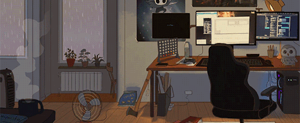

  

<!-- Profile Views -->
  
  <!-- Github Stars -->
  
  <!-- Latest commit -->
  

<h2>𝐴𝑏𝑜𝑢𝑡 𝑀𝑒 </h2>

<ul>
  <li>🔭 I’m currently working on something cool !</li>
  <li>🌱 I’m currently learning <b>Typescript, React Native, Laravel and Docker</b>.</li>
  <li>📫 How to reach me: <b><a href="mailto:john.carv.sousa@gmail.com">nixxojam@gmail.com</a></b></li>
  <li>⚡ Fun fact: I'm a huge fan of Marvel</li>
</ul>

 

  

<h2>𝑆𝑡𝑎𝑡𝑠</h2>

  
  

<h2>𝑇𝑒𝑐ℎ𝑛𝑜𝑙𝑜𝑔𝑖𝑒𝑠 𝑎𝑛𝑑 𝑇𝑜𝑜𝑙𝑠</h2>

<!-- Javascript -->
  
<!-- Typescript -->
  
<!-- React -->
  
  <!-- Laravel -->
  
  <!-- NodeJS -->
  
<!-- NPM -->
  
<!-- Tailwind -->
  
  <!-- Git -->
  
  <!-- Github -->
  
  <!-- Firebase -->
  
  <!-- MySQL -->
  
  <!-- VS Code -->
  
  <!-- Adobe XD -->
  
  <!-- Figma -->
  

<h2>𝐶𝑜𝑛𝑡𝑎𝑐𝑡</h2>

  
  
  
  

